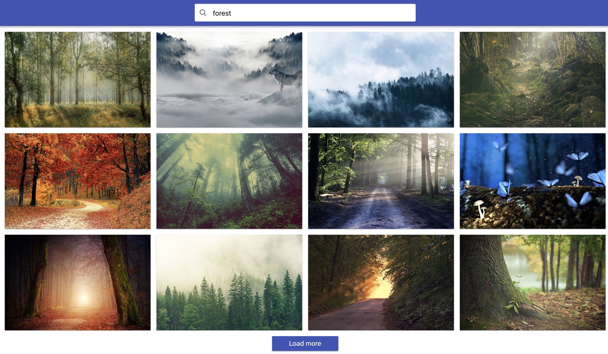

**Read in other languages: [Russian](README.md), [Ukrainian](README.ua.md).**

# Image Search

Write a keyword image search application. Preview of a working
application
[see link](https://drive.google.com/file/d/1oXCGyiq4uKwW0zzraZLKk4lh3voBlBzZ/view?usp=sharing).

Create the components `<Searchbar>`, `<ImageGallery>`, `<ImageGalleryItem>`,
`<Loader>`, `<Button>` and `<Modal>`. Ready styles of components can be taken from
file [styles.css](./styles.css) and tweaked it to your liking as needed.



## Instruction Pixabay API

For HTTP requests, use the public image search service
[Pixabay](https://pixabay.com/api/docs/). Register and get a private
access key.

URL string of the HTTP request.

```bash
https://pixabay.com/api/?q=что_искать&page=номер_страницы&key=твой_ключ&image_type=photo&orientation=horizontal&per_page=12
```

Pixabay API supports pagination, by default the `page` parameter is `1`.
Let 12 objects come in the response, set in the `per_page` parameter. Don't
remember that when searching for a new keyword, it is necessary to reset the value of
`page` to `1`.

The response from the API comes with an array of objects in which you are only interested in the following properties.
the following properties.

- `id` - unique ID
- `webformatURL` - link to a small image for the card list
- `largeImageURL` - link to the large image for the modal window

## Searchbar component description

The component takes one prop `onSubmit` - a function to pass the value of the input
when submitting a form. Creates a DOM element of the following structure.

```html
<header className="Searchbar">
  <form className="SearchForm">
    <button type="submit" className="SearchForm-button">
      <span className="SearchForm-button-label">Search</span>
    </button>

    <input
      className="SearchForm-input"
      type="text"
      autocomplete="off"
      autofocus
      placeholder="Search images and photos"
    />
  </form>
</header>
```

## Component Description ImageGallery

List of image cards. Creates a DOM element of the following structure.

```html
<ul className="ImageGallery">
  <!-- Set <li> with images -->
</ul>
```

## Component Description ImageGalleryItem

List item components with an image. Creates a DOM element with the following
structure.

```html
<li className="ImageGalleryItem">
  
</li>
```

## Component Description Button

When you press the `Load more` button, the next portion of images should be loaded and rendered together with the previous ones.
images and render together with the previous ones. After loading and rendering a new
batch of images, the page should scroll smoothly. For scrolling use
the following code.

```js
window.scrollTo({
  top: document.documentElement.scrollHeight,
  behavior: 'smooth',
});
```

The button should only render when there are some loaded
images. If the image array is empty, the button is not rendered.

## Component Description Loader

The spinner component is displayed while the isobars are loading. Use any
off-the-shelf component, such as
[react-loader-spinner](https://github.com/mhnpd/react-loader-spinner) or any
other.

## Component Description Modal

Clicking on a gallery item should open a modal window with a dark overlay and display a large version of the image.
overlay and display a large version of the image. The modal window should
close by pressing the `ESC` key or clicking on the overlay.

The appearance is similar to the functionality of this
[VanillaJS-plugin](https://basiclightbox.electerious.com/), only instead of the
white modal window, the image is rendered (in the example, click `Run`). Animation
is not necessary!

```html
<div className="Overlay">
  <div className="Modal">
    
  </div>
</div>
```
